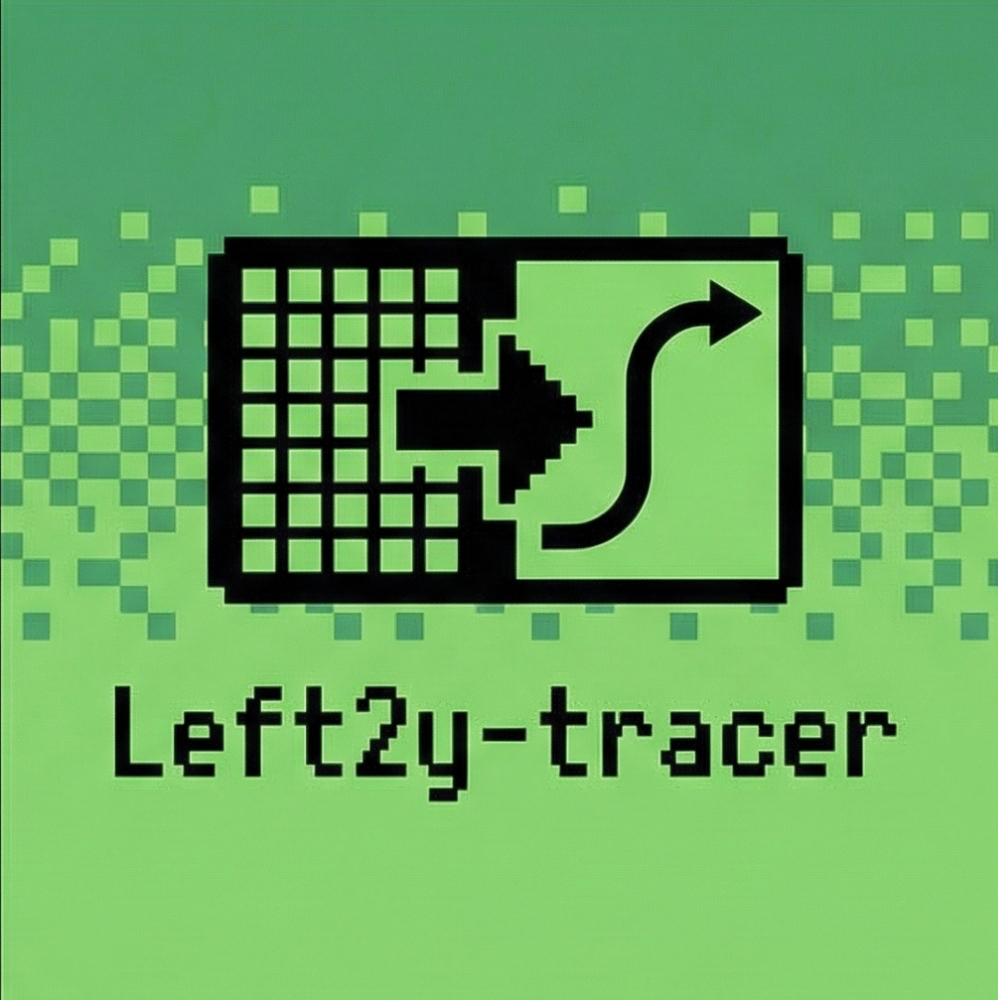

# Eagle Raster to Vector (Left2y-tracer)



一个将位图 (PNG, JPG, BMP) 转换为矢量 SVG 的 **Eagle** 插件。特别适合将 Logo、手绘草图、扫描件快速矢量化。

## ✨ 功能特点

- **极速转换**：基于 `potrace` 算法，毫秒级转换速度。
- **批量处理**：支持多选图片批量转换，带进度条和取消功能。
- **智能预设**：
  - `Logo / 图标`：自动平滑曲线，去噪，适合清晰图形。
  - `手绘 / 扫描稿`：保留更多笔触细节，还原手绘质感。
- **反相模式**：支持“白底黑字”与“黑底白字”的一键切换。
- **无缝集成**：转换后的 SVG 自动导入到 Eagle 当前文件夹，保留原图信息。
- **本地运行**：无需上传服务器，所有处理均在本地完成，隐私安全。

## 📦 安装方法

1.  下载本插件包（解压为文件夹）。
2.  打开 Eagle 软件。
3.  点击左侧侧边栏的 **"插件中心" > "开发者选项"**。
4.  点击 **"加载未打包的插件..."**。
5.  选择本插件的目录即可。

## 🖥 使用指南

1.  在 Eagle 中选中一张或多张图片（支持 PNG/JPG）。
2.  点击插件图标打开面板。
3.  在下拉框选择模式（Logo 或 手绘）。
4.  如果是白底黑字的图片，请取消勾选“反相”（默认不勾选提取黑色）。
5.  点击 **"开始转换"**。
6.  稍等片刻，生成的 SVG 会自动出现在原图旁边。

## 🛠 开发构建

本插件基于 Eagle Plugin API 开发，使用 Node.js / Electron 技术栈。

### 目录结构

```
.
├── assets/          # 静态资源 (图标)
├── bin/             # 二进制可执行文件 (potrace)
│   └── darwin-arm64/
├── src/
│   ├── adapters/    # Eagle API 与文件系统适配器
│   ├── core/        # 核心逻辑 (pipeline, potrace 封装)
│   └── ui/          # 界面逻辑 (设置面板)
├── index.html       # 主界面
├── main.js          # 插件入口与主控逻辑
└── manifest.json    # 插件清单
```

### 依赖说明

- **potrace**: 核心矢量化引擎 (GPLv2)。
- **sips**: macOS 内置图像处理工具（用于格式转换）。

## 📄 License

MIT License
